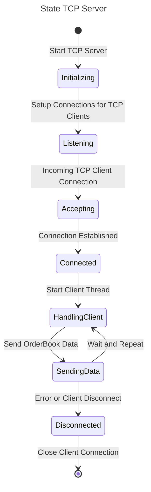
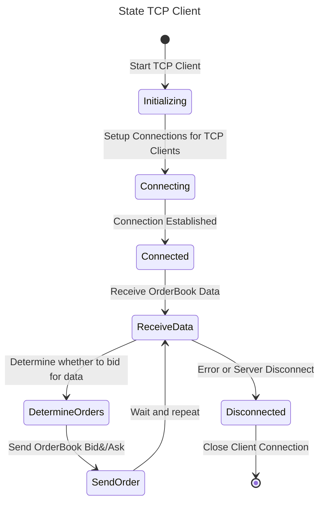

# Trading-Server

Example application based off coding assignment

## Build Applications

I have used docker and CMake to ensure some easy build and test on another users machine. In case they do not have gcc/boost/cmake installed.

### Dependencies

(Linux)

I used ubuntu so apt packages but if you can gather these versions you can also build the software

- Boost 1.79 (No specific reason, updated to latest known vrsion without CVE Issues)

Dockerfiles are included to help build on environments so that the software versions are maintained on compilation, with GCC its helpful to set a baseline.

```bash
docker compose build
```

If you want full build outputs from docker
```bash
docker compose build --progress=plain --no-cache
```

Using CMake and Docker for build simplicity

## Run Application

```bash
docker compose up
```

The client is set to constant Q and N values

## Design

Mermaid JS design - [VS Code](https://marketplace.visualstudio.com/items?itemName=bierner.markdown-mermaid)



---



### Assumptions & Explanations

- An order book is a list of buy orders (bids) and sell orders (asks) for a specific asset.
- Tick size refers to the minimum price movement of a financial instrument or asset in the market. It defines the smallest increment by which the price of a security can move. For example:
  - If the tick size for a stock is 1, the price can only change in increments of 1 (e.g., 100, 101, 102, etc.).
- The Best Bid is the highest price that someone is willing to pay for the asset.
- The Best Ask is the lowest price at which someone is willing to sell the asset.
- Quantity determines how much quantity must be accumulated from the order book layers to identify the best bid and ask. For example:
  - If Q = 0, you just look at the first available bid and ask prices.
  - If Q = 10, you accumulate quantities from several layers until the cumulative quantity reaches or exceeds 10.
- No limits on order size or position limits.
- Tick size is always equal to 1.
- Market data has no multiplier.
- No latency for updating orders.
- Orders must be canceled before sending new ones.
- Orders are never rejected.